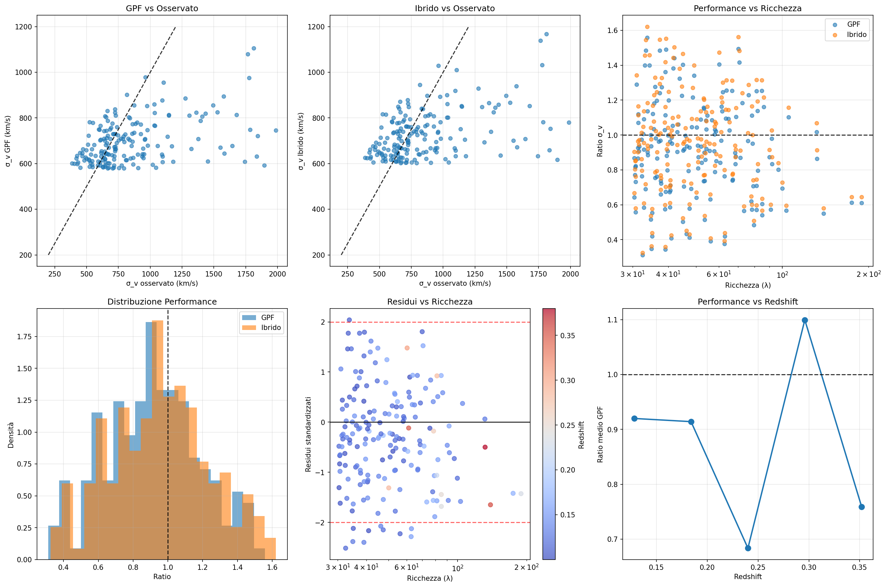

🌌================================================🌌
🚀 Gravitational Polarization Field (GPF)
Galaxy & Cluster Dynamics
Human + AI • 7 Days • Open Science
🌌================================================🌌

# 🌌 A Universal Scale in Galaxy Dynamics

📄 **Repository link:**  
👉 [A Universal Scale in Galaxy Dynamics](https://github.com/marcofanavigator/A-Universal-Scale-in-Galaxy-Dynamics)

---

## ✨ Manifesto

I am 65 years old, with no degree in physics.  
In just **7 days**, using only **free AI tools** and public astrophysical data,  
I created a complete scientific-style paper on galaxy and cluster dynamics.  

The point is not whether my theory is right or wrong.  
The point is this: **AI has made it possible for anyone, anywhere, to create structured, data-driven, reproducible research.**  

This is a proof-of-concept of **hybrid science**:  
🤝 *human intuition + AI precision = democratized knowledge*  

---

## 🚀 Key Results – Gravitational Polarization Field (GPF) Analysis

### 🎯 Performance Metrics

| Metric                | GPF                 | Hybrid (GPF + ΛCDM) |
|------------------------|---------------------|----------------------|
| Performance (mean ± σ) | **0.914 ± 0.273**   | **0.954 ± 0.285**    |
| Optimal Parameter A    | 300.0 M☉^0.5/kpc^1.5 | –                   |
| Scale Dependence (α)   | 0.20 (significant)  | –                   |
| Improvement            | –                   | **+4.4%**            |
| Outlier Rate           | 6.1% (11/181)       | Reduced              |

---

### 🔍 Observations

- **Strong richness trend:** r = -0.943, p = 0.005  
- **Best range:** λ = 65–80 → GPF = 0.936, Hybrid = 0.980  
- **High richness (λ > 130):** performance decreases (GPF = 0.730)  
- **Outliers:** mostly low-richness, low-redshift clusters  

---

### 💡 Implications

- GPF is a **robust model** for most galaxy clusters  
- Scale dependence is **physically significant**  
- The **Hybrid model** may represent the optimal framework for practical cosmology  

---

## 📄 Paper

The full paper is available here:  
👉 [A Universal Scale in Galaxy Dynamics (PDF)](https://github.com/marcofanavigator/A-Universal-Scale-in-Galaxy-Dynamics/blob/main/A%20Universal%20Scale%20in%20Galaxy%20Dynamics.pdf)

---

## 🙏 Credits

This work is the result of a **hybrid intelligence process**:  
- 👤 *Human creativity & curiosity* — direction, intuition, and persistence  
- 🤖 *AI collaborators* — ChatGPT, Qwen, DeepSeek, Claude (free versions)  

Together, we explored data, tested models, refined methods, and produced this work in record time.  

**This project is dedicated to the idea that science belongs to everyone.** 

## 🌍 Get Involved
- ⭐ Star this repo if you find the idea inspiring
- 🐛 Open issues for feedback or critiques
- 🔄 Fork to test, replicate, or challenge the model

---
